# Présentation des données 
Le dataset comporte 42694 lignes. 

Durée moyenne entre les observations : 3 heures 

Variance de la fréquence : 10 minutes 

Valeur moyenne : 12.443184053965448 

Variance des valeurs : 7.28 (58.541682773528535 %)

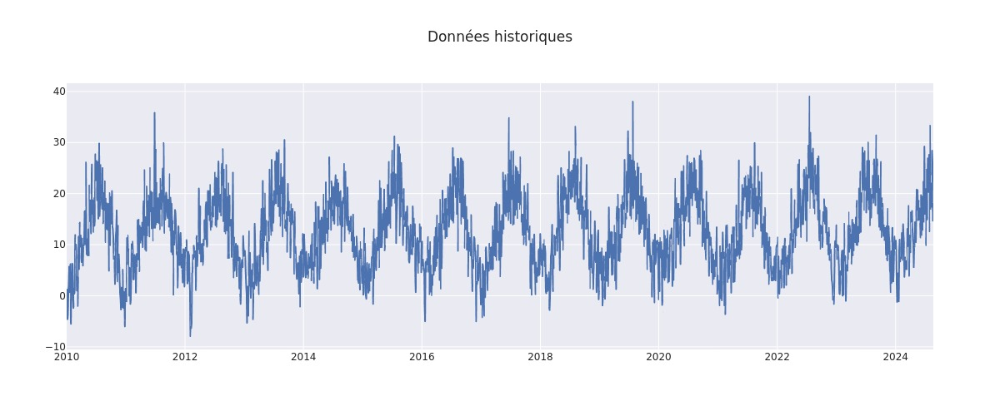 

## Impact du mois 
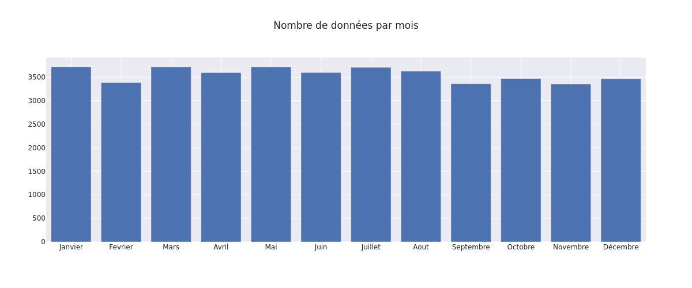 
Nombre de point moyen par mois: 3557.8333333333335 

Variance du nombre de points par jour: 140.47 (3 %) 

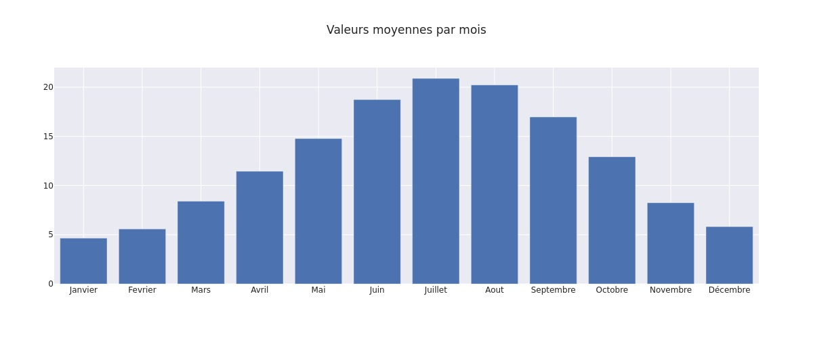 

Valeur moyenne quotidienne: 12.391581856240213 

Variance des moyennes quotidiennes 5.65 (45 %) 

## Impact du jour de la semaine 
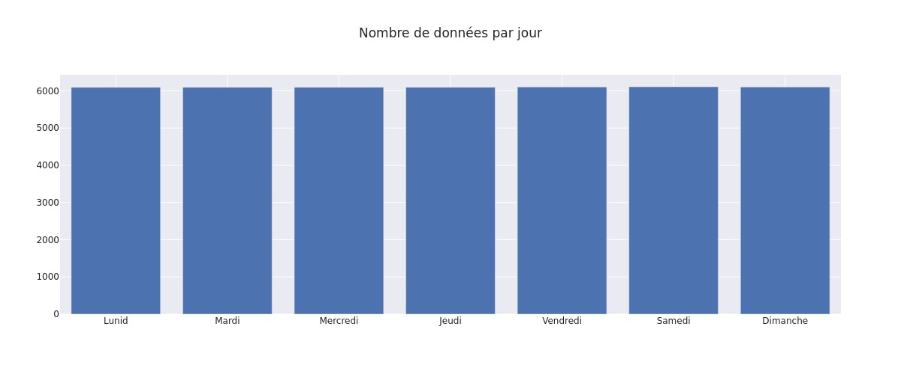 
Nombre de point moyen par mois: 6099.142857142857 

Variance du nombre de points par mois: 5.56 (0 %) 

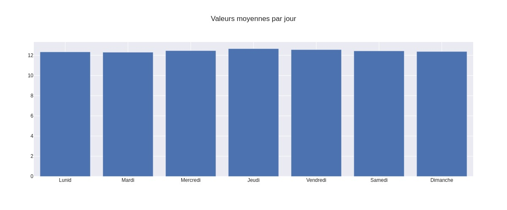 

Valeur moyenne mensuelle: 12.44316310048823 

Variance des moyennes mensuelles 0.11 (0 %) 

## Impact de l'année 
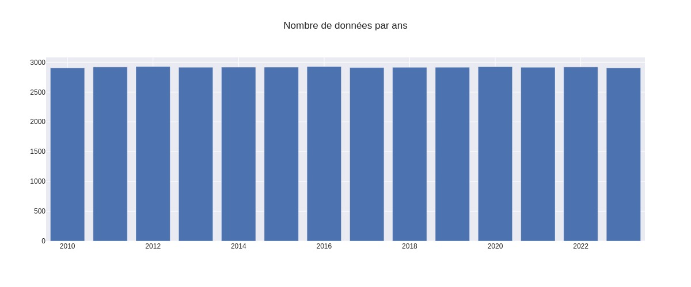 
Nombre de point moyen par ans: 2916.6428571428573 

Variance du nombre de points par ans: 6.409893500977808 (0 %) 

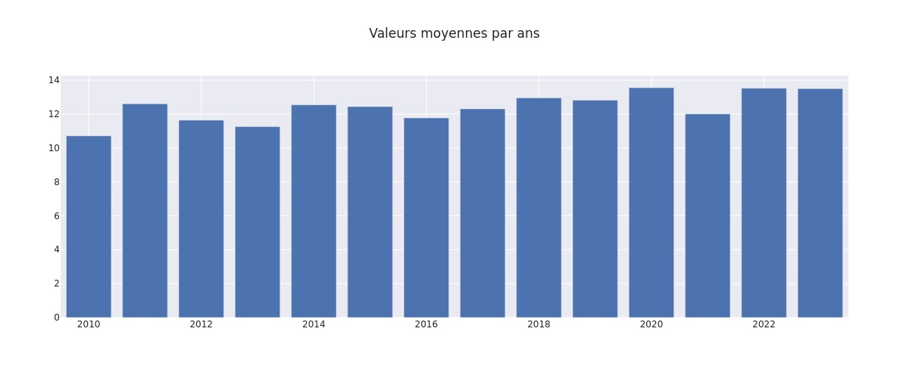 

Valeur moyenne annuelle: 12.401078760803134 

Variance des moyennes annuelles 0.8287797173618122 (6 %) 

 # Modèle 

### Modèle sur split aléatoire

|Catégorie|MSE|R2|MAE|
|---------|---|--|---|
|train|15.20958215203636|0.713708846818303|3.107246524804181|
|test|15.100377815297295|0.7140587263560876|3.0932404275561236|

 ### Modèle sur split temporel

|Catégorie|MSE|R2|MAE|
|---------|---|--|---|
|train|15.37829198940564|0.7109152865859404|3.1289863217236418|
|test|14.521872042042581|0.7208576570345686|3.027260014265633|

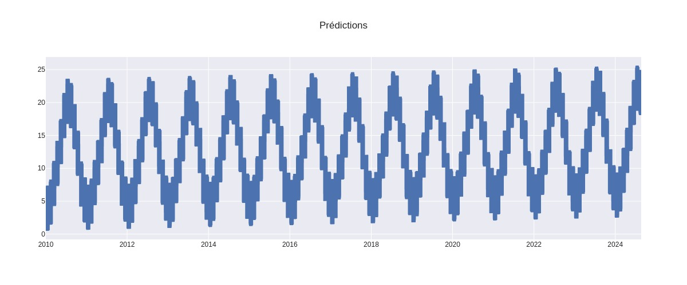  
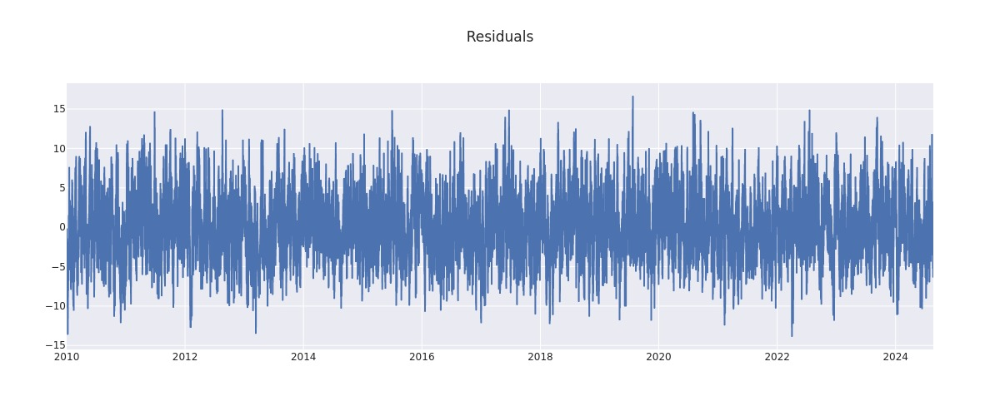  
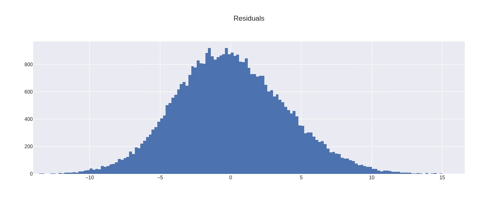  
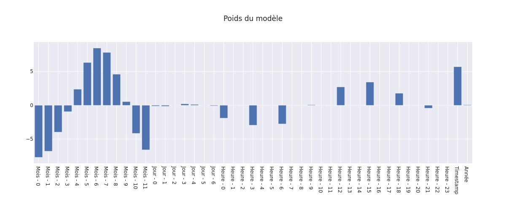  

 ### Confidency 
|Seuil|Erreur|
|-----|------|
|75%|4.447643172986998|
|80%|4.951348664298468|
|90%|6.402697852627905|
|95%|7.6974920760081815|
|99%|10.111906673146226|
|99.5%|11.046615803426326|
|99.9%|12.948903041112427|

 ## Résidus par variables 

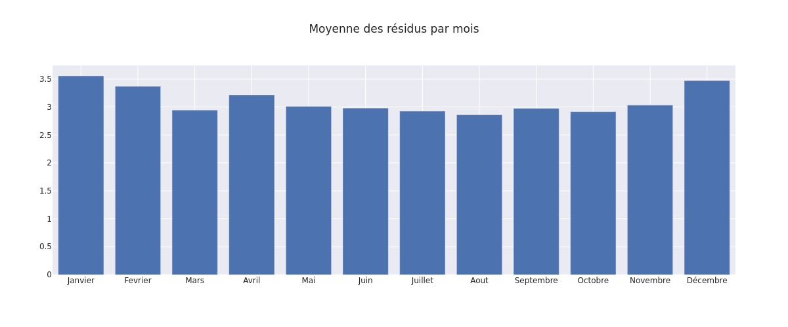  
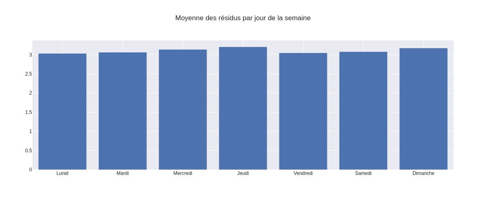  
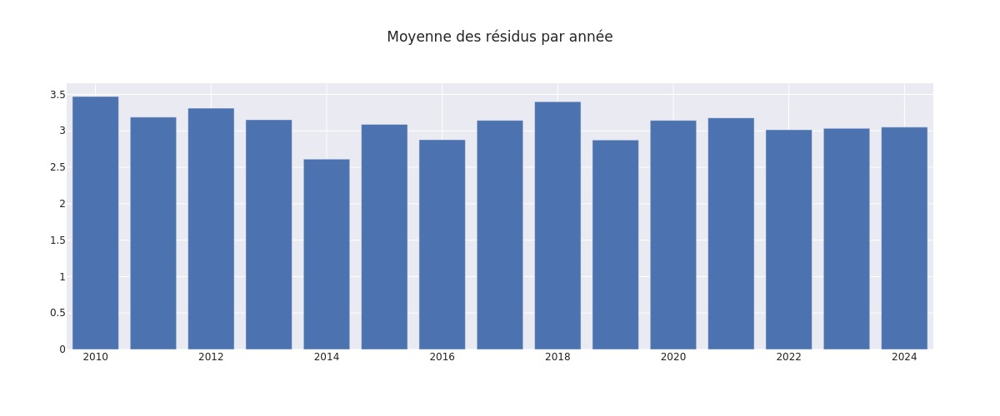  

 ## Corrélation des résidus 
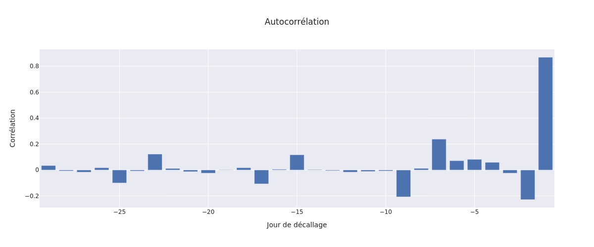  
R2 de prédictions des résidus: 0.7382785827004958   
R2 de prédiction final: 0.9250081883274379   

