# Présentation des données 
Le dataset comporte 42694 lignes. 

Durée moyenne entre les observations : 3 heures 

Variance de la fréquence : 10 minutes 

Valeur moyenne : 12.443184053965448 

Variance des valeurs : 7.28 (58.541682773528535 %)

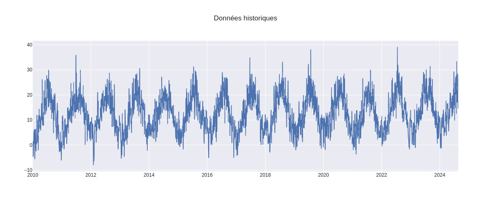 

## Impact du mois 
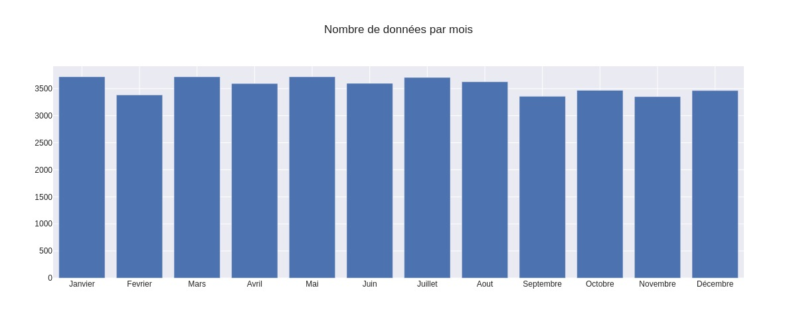 
Nombre de point moyen par mois: 3557.8333333333335 

Variance du nombre de points par jour: 140.47 (3 %) 

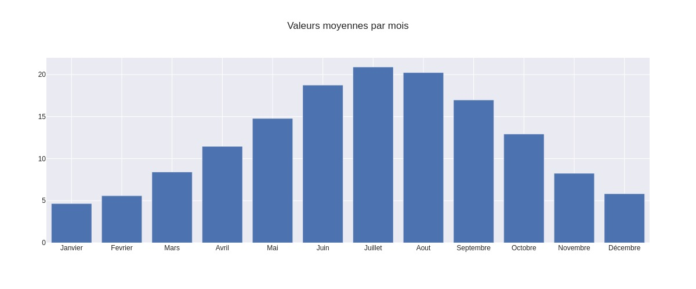 

Valeur moyenne quotidienne: 12.391581856240213 

Variance des moyennes quotidiennes 5.65 (77 %) 

## Impact du jour de la semaine 
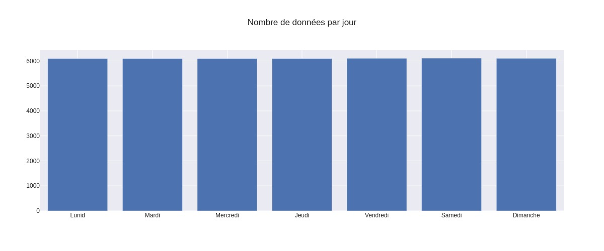 
Nombre de point moyen par mois: 6099.142857142857 

Variance du nombre de points par mois: 5.56 (0 %) 

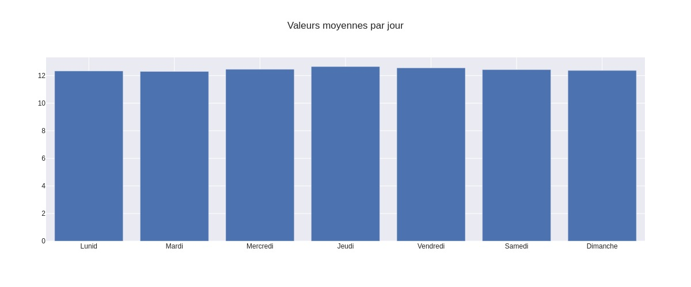 

Valeur moyenne mensuelle: 12.44316310048823 

Variance des moyennes mensuelles 0.11 (1 %) 

## Impact de l'année 
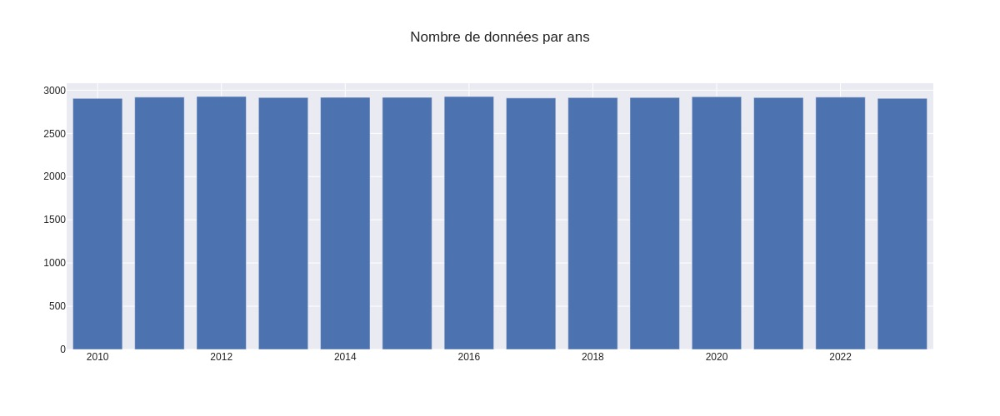 
Nombre de point moyen par ans: 2916.6428571428573 

Variance du nombre de points par ans: 6.409893500977808 (0 %) 

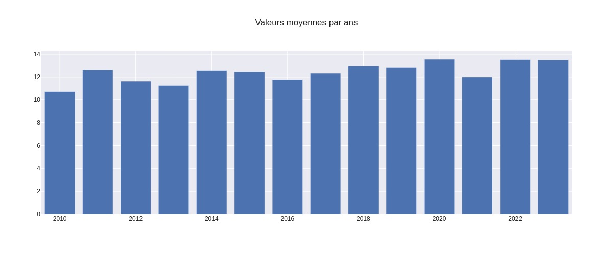 

Valeur moyenne annuelle: 12.401078760803134 

Variance des moyennes annuelles 0.8287797173618122 (11 %) 

 # Modèle 

### Modèle sur split aléatoire

|Catégorie|MSE|R2|MAE|
|---------|---|--|---|
|train|15.19|0.71|3.1|
|test|15.15|0.71|3.1|

 ### Modèle sur split temporel

|Catégorie|MSE|R2|MAE|
|---------|---|--|---|
|train|15.37|0.71|3.12|
|test|14.52|0.72|3.02|

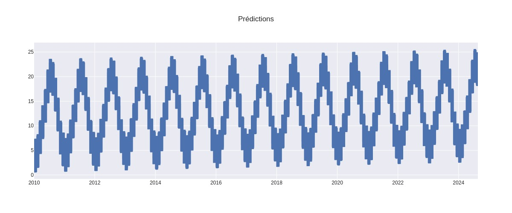  
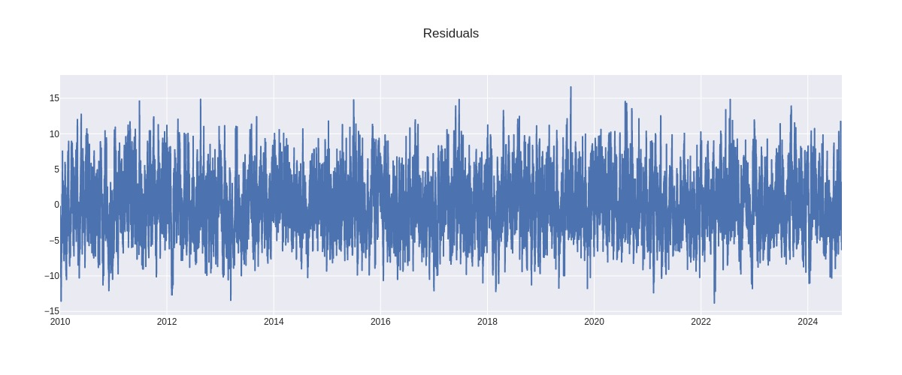  
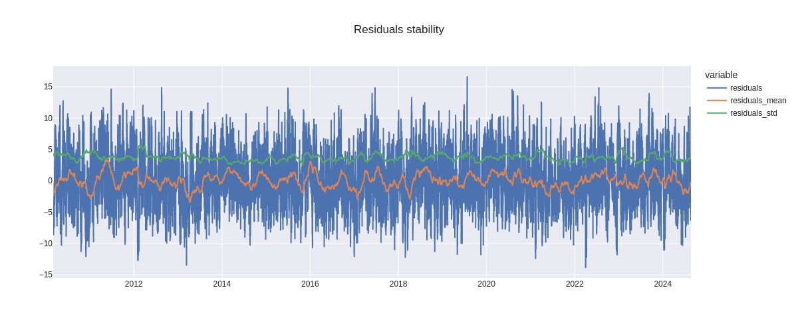  
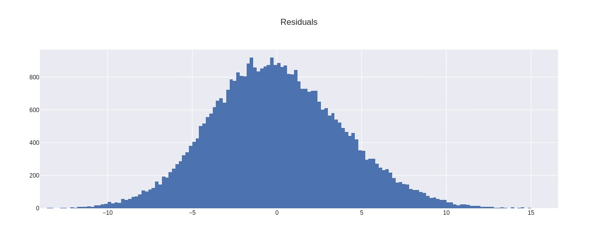  
Coefficient de regression pour la moyenne: -0.09455919871339634 (r2: 0.0006147524345649913)   
Coefficient de regression pour la variance: -0.10067011060336538 (r2: 0.0006147524345649913)  
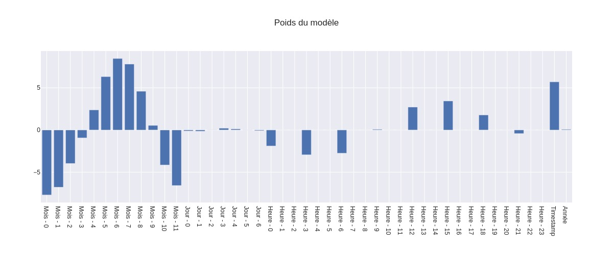  

 ### Confidency 
|Seuil|Erreur|
|-----|------|
|75%|4.44|
|80%|4.95|
|90%|6.4|
|95%|7.69|
|99%|10.11|
|99.5%|11.04|
|99.9%|12.94|

 ## Résidus par variables 

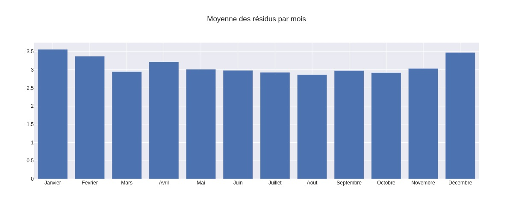  
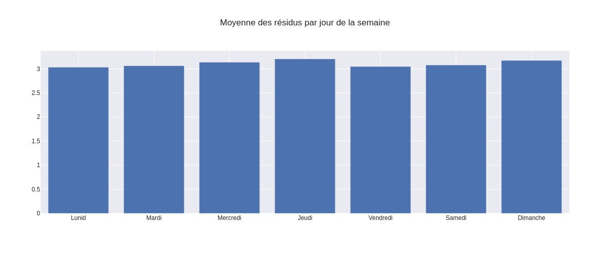  
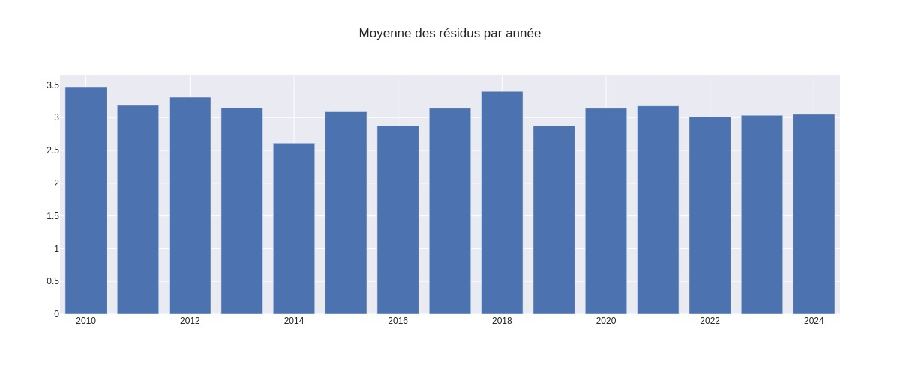  

 ## Corrélation temporelle des résidus 
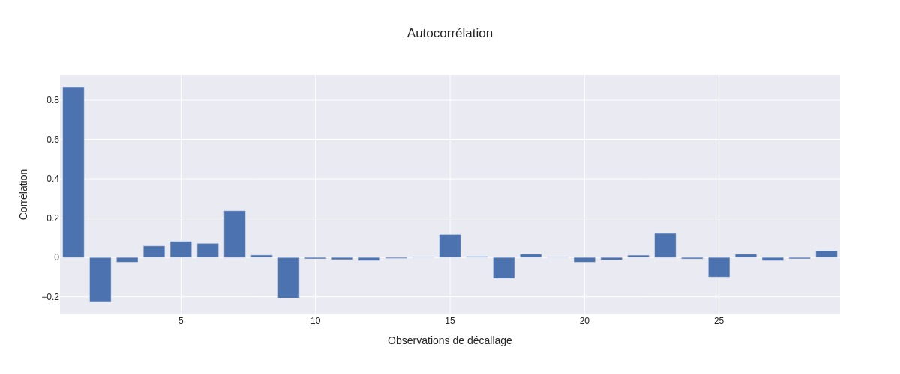  
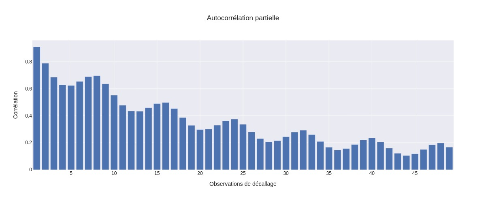  
R2 de base: 0.71   
R2 de prédictions des résidus: 0.73   
R2 de prédiction final: 0.92   
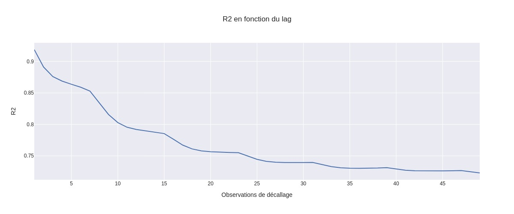  

