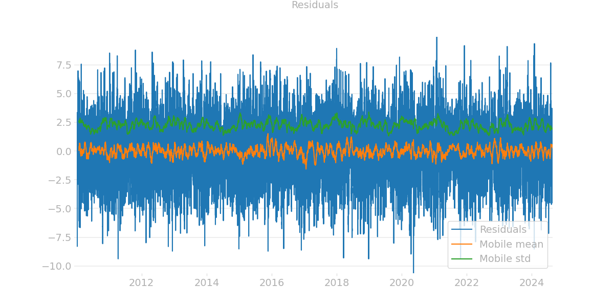
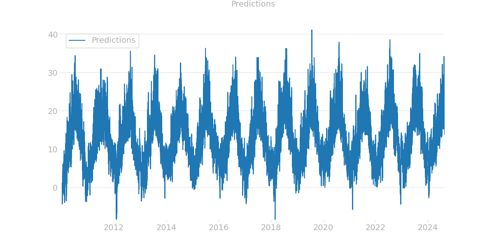
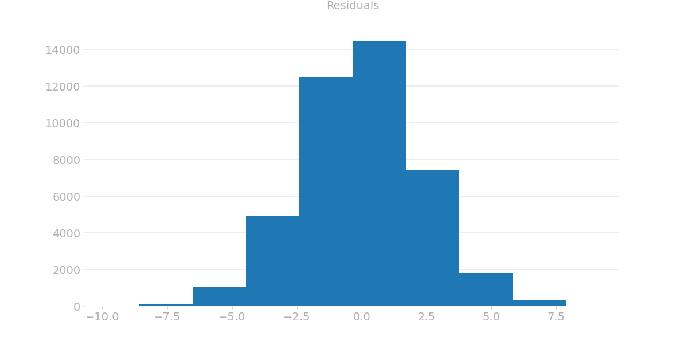
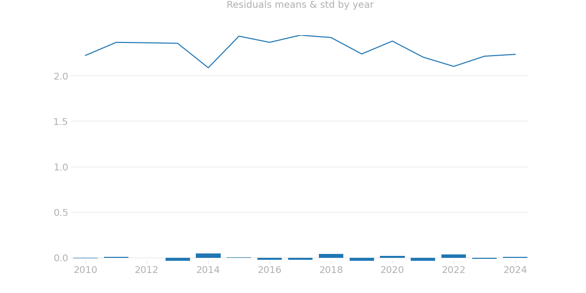
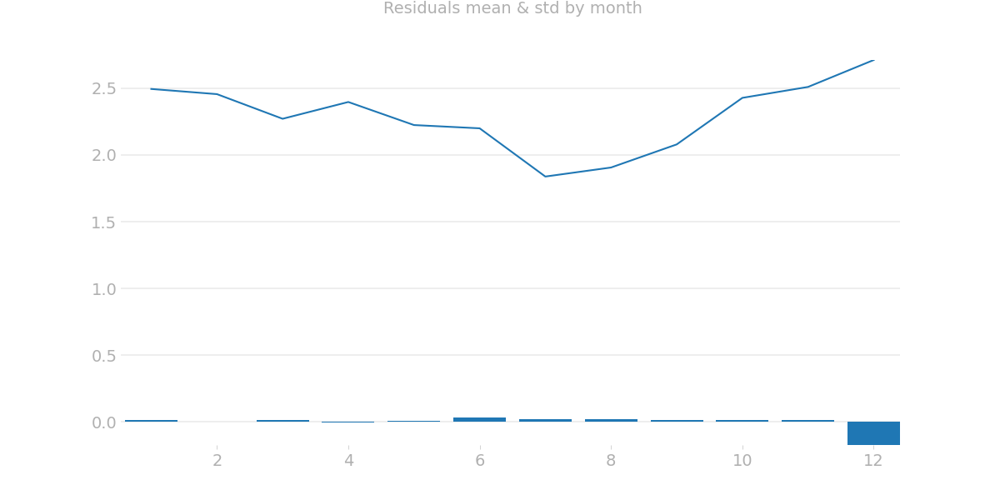
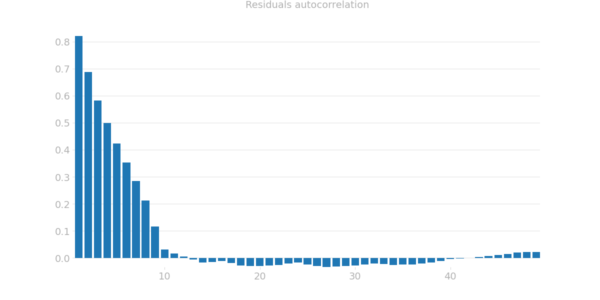
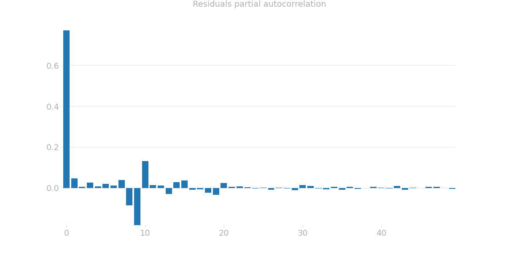

# Residuals analysis

|Metric|Value|
|---|---|
|MSE| 5.301326765474615|
|R2| 0.900020430636143|
|Mean| 1.818686965960075|
|Std| 2.302461021984005|
|Mobile mean regression coeff| -0.00405028468758955|   
|Mobile stds regression coeff| -0.11276170232527963| 
|Confidency 90%| 3.774271392822243| 
|Confidency 95%| 4.577254915237404| 
|Confidency 99%| 6.163070106506325| 

## Variables
### Year

### Month

## Autocorrelation

